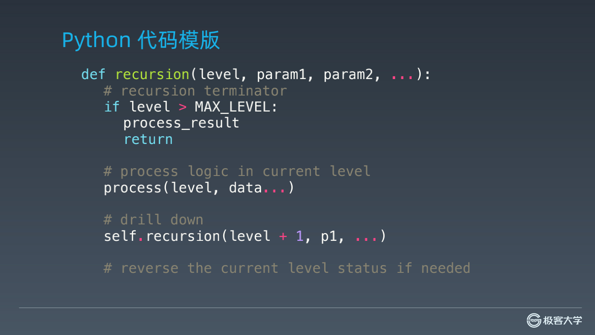
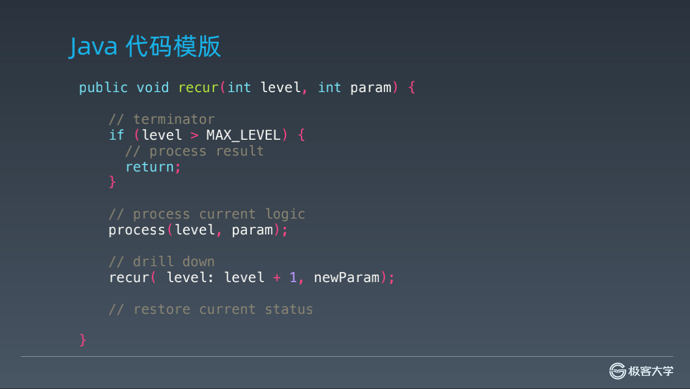

### 递归

1. 树的面试题解法，一般都是递归，原因：
   - 节点的定义：它的节点和树本身数据结构就是用递归方式定义的  
   - 重复性：  不仅是树本身，二叉树，以及搜索二叉树，在定义数据结构和算法特性的时候，也是有重复性
1. 本质是循环,通过函数体来进行的循环
1. 电影《盗梦空间》解析：
    - 向下进入到不同梦境中；向上又回到原来一层
    - 通过声音同步回到上一层
    - 每一层的环境和周围的人都是一份拷贝、**主角等几个人穿越不同层级的梦境（发生和携带变化）**
1. 函数结构：
    - 1、terminator 递归终止条件
    - 2、process 处理当前层逻辑
    - 3、drill down 下探到下一层
    - 4、reverse status 清理当前层（选择性，全局变量等原因）
1. 思维要点：
    - 不要人肉进行递归（最大误区）
    - 找到最近最简方法，将其拆解成可重复解决的问题（重复子问题），写的重复指令只包括if、else、for、while、loop、recursion（递归）
    - 数学归纳法思维，处理完当前层逻辑，推导当前+1也是ok的

1. 函数结构：
    - 
    - 

1. leetcode相关题

   - 爬楼梯  

     <https://leetcode-cn.com/problems/climbing-stairs/>

   - 括号生成  

     <https://leetcode-cn.com/problems/generate-parentheses/>

   - 翻转二叉树   

     <https://leetcode-cn.com/problems/invert-binary-tree/description/>

   - 验证二叉搜索树   

     <https://leetcode-cn.com/problems/validate-binary-search-tree>

   - 二叉树的最大深度   

     <https://leetcode-cn.com/problems/maximum-depth-of-binary-tree/>

   - 二叉树的最小深度   

     <https://leetcode-cn.com/problems/minimum-depth-of-binary-tree/>

   - 二叉树的序列化与反序列化   

     <https://leetcode-cn.com/problems/serialize-and-deserialize-binary-tree/>

   - 二叉树的最近公共祖先(老高频题)   

     <https://leetcode-cn.com/problems/lowest-common-ancestor-of-a-binary-tree/>

   - 从前序与中序遍历序列构造二叉树   

     <https://leetcode-cn.com/problems/construct-binary-tree-from-preorder-and-inorder-traversal/>

   - 组合   

     <https://leetcode-cn.com/problems/combinations/>

   - 全排列   

     <https://leetcode-cn.com/problems/permutations/>

### 分治、回溯

1. 一种特殊的递归、复杂的递归
1. 最优重复性：动态规划
1. 分治Divide & Conquer
   - 找重复性、分解问题、组合每个子问题结果
   - 特征：在泛形递归3、4步骤之间， 在组合一下3产生的结果
1. 回溯Backtracking
    ```
    回溯法采用试错的思想，它尝试分步的去解决一个问题。在分步解决问题的过程
    中，当它通过尝试发现现有的分步答案不能得到有效的正确的解答的时候，它将
    取消上一步甚至是上几步的计算，再通过其它的可能的分步解答再次尝试寻找问
    题的答案。
    
    回溯法通常用最简单的递归方法来实现，在反复重复上述的步骤后可能出现两种
    情况：
    
    • 找到一个可能存在的正确的答案；
    
    • 在尝试了所有可能的分步方法后宣告该问题没有答案。
    
    在最坏的情况下，回溯法会导致一次复杂度为指数时间的计算。
    ```
2. leetcode相关题
    - Pow(x, n)  
    <https://leetcode-cn.com/problems/powx-n/>
    - 子集  
    <https://leetcode-cn.com/problems/subsets/>
    - 多数元素（简单、但是高频）  
    <https://leetcode-cn.com/problems/majority-element/description/>
    - 电话号码的字母组合  
    <https://leetcode-cn.com/problems/letter-combinations-of-a-phone-number/>
    - N皇后  
    <https://leetcode-cn.com/problems/n-queens/>