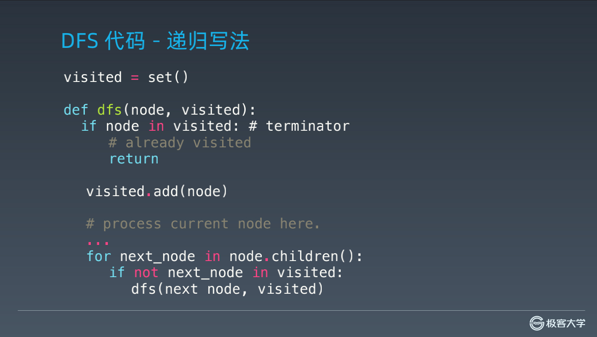
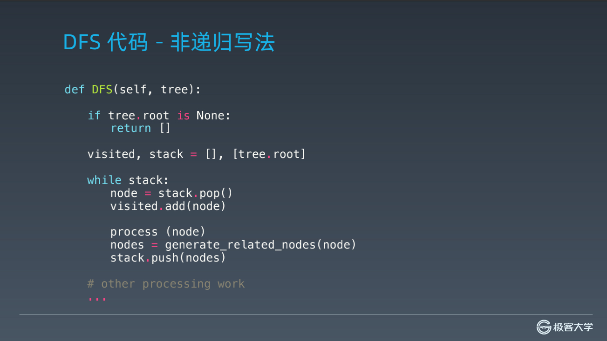

### 深度优先搜索和广度优先搜索

1. 搜索 - 遍历：
   - 每个节点都要访问一次  
   - 每个节点仅仅要访问一次
   - 对于节点的访问顺序不限
   - 深度优先：depth first search
   - 广度优先：breadth first search
1. dfs函数结构：
    ```
    /**
     * $res 要返回结果
     *
     * @param 路径 ‘中间值’
     * @param 选择列表
     */
    function dfs(路径,选择列表)
    {
        if(结束条件){
            array_push($res,路径);
            return;
        }
    
        foreach (选择列表 as 选择) {
            选择 push
            dfs(路径,选择列表);
            撤销选择 pop
        }
    }
    ```
1. 函数结构：
    - 
    - 
    - 
1. leetcode相关题

   - 二叉树的层序遍历  

     <https://leetcode-cn.com/problems/binary-tree-level-order-traversal/#/description>

   - 最小基因变化  

     <https://leetcode-cn.com/problems/minimum-genetic-mutation/#/description>

   - 括号生成   

     <https://leetcode-cn.com/problems/generate-parentheses/#/description>

   - 在每个树行中找最大值   

     <https://leetcode-cn.com/problems/find-largest-value-in-each-tree-row/#/description>

   - 单词接龙   

     <https://leetcode-cn.com/problems/word-ladder/description/>

   - 单词接龙 II   

     <https://leetcode-cn.com/problems/word-ladder-ii/description/>

   - 岛屿数量   

     <https://leetcode-cn.com/problems/number-of-islands/>

   - 扫雷游戏   

     <https://leetcode-cn.com/problems/minesweeper/description/>
     
### 贪心算法     

1. 概念：
   - 贪心算法是一种在每一步选择中都采取在当前状态下最好或最优（即最有
     利）的选择，从而希望导致结果是全局最好或最优的算法  
   - 贪心算法与动态规划的不同在于它对每个子问题的解决方案都做出选择，不
     能回退。动态规划则会保存以前的运算结果，并根据以前的结果对当前进行
     选择，有回退功能
   - 贪心法可以解决一些最优化问题
   - 然而对于工程和生活中的问题，贪心法一般不能得到我们所要求的答
     案
   - 一旦一个问题可以通过贪心法来解决，那么贪心法一般是解决这个问题的最
     好办法。由于贪心法的高效性以及其所求得的答案比较接近最优结果，贪心
     法也可以用作辅助算法或者直接解决一些要求结果不特别精确的问题。

1. 适用情况：
   - 简单地说，问题能够分解成子问题来解决，子问题的最优解能递推到最终
     问题的最优解。这种子问题最优解称为最优子结构  
   - 贪心算法与动态规划的不同在于它对每个子问题的解决方案都做出选择，
     不能回退。动态规划则会保存以前的运算结果，并根据以前的结果对当前
     进行选择，有回退功能。
1. 与回溯动态规划区别：
   - 贪心：当下做局部最优判断  
   - 回溯：能够回退
   - 动态规划：最优判断+回退
1. leetcode相关题

   - 柠檬水找零（亚马逊在半年内面试中考过）  

     <https://leetcode-cn.com/problems/lemonade-change/description/>

   - 买卖股票的最佳时机 II （亚马逊、字节跳动、微软在半年内面试中考过）  

     <https://leetcode-cn.com/problems/best-time-to-buy-and-sell-stock-ii/description/>

   - 分发饼干（亚马逊在半年内面试中考过）   

     <https://leetcode-cn.com/problems/assign-cookies/description/>

   - 模拟行走机器人   

     <https://leetcode-cn.com/problems/walking-robot-simulation/description/>

   - 跳跃游戏 II （亚马逊、华为、字节跳动在半年内面试中考过）   

     <https://leetcode-cn.com/problems/jump-game-ii/>
     
### 二分查找     
1. 二分查找的前提：
   - 目标函数单调性（单调递增或者递减  
   - 存在上下界（bounded）
   - 能够通过索引访问（index accessible)

1. 代码模板：
    ```
    $count = count($array);
    $left = 0;
    $right = $count - 1;
    while ($left < $right) {
        $mid = $left + floor(($right - $left) / 2);
        if ($array[$mid] == $target) {
            break or return $target;
        } elseif ($array[$mid] < $target) {
            $left = $mid + 1;
        } else {
            $right = $mid - 1;
        }
    }
    ```
1. leetcode相关题

   - x 的平方根（字节跳动、微软、亚马逊在半年内面试中考过）  

     <https://leetcode-cn.com/problems/sqrtx/>

   - 有效的完全平方数  

     <https://leetcode.com-cn/problems/valid-perfect-square/>

   - 搜索旋转排序数组（Facebook、字节跳动、亚马逊在半年内面试常考）  

     <https://leetcode-cn.com/problems/search-in-rotated-sorted-array/>

   - 搜索二维矩阵（亚马逊、微软、Facebook 在半年内面试中考过）  

     <https://leetcode-cn.com/problems/search-a-2d-matrix/>

   - 寻找旋转排序数组中的最小值（亚马逊、微软、字节跳动在半年内面试中考过）  

     <https://leetcode-cn.com/problems/find-minimum-in-rotated-sorted-array/>